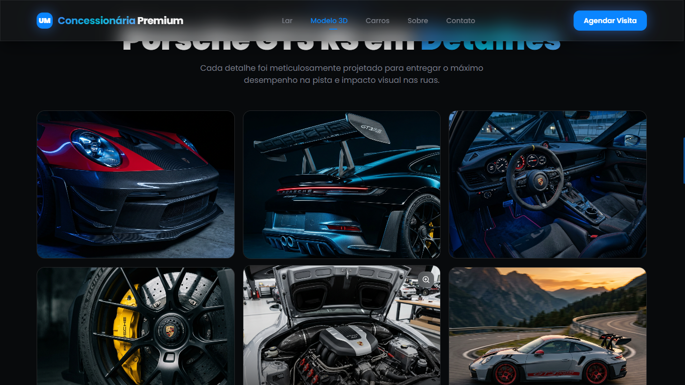
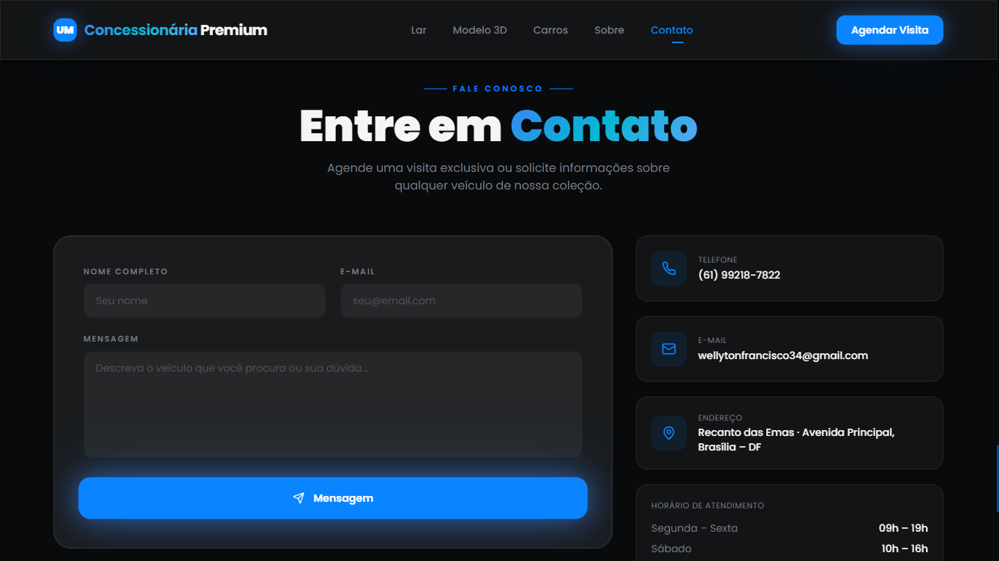
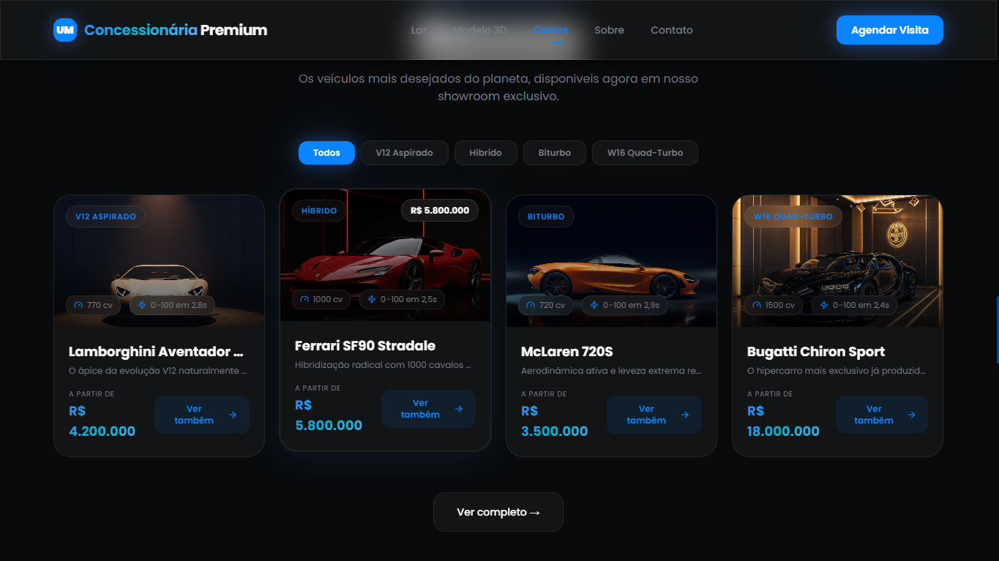

# 🏎️ Porsche 992 GT3 RS - AutoLux Drive Prime

Projeto web desenvolvido para apresentar a experiência premium do **Porsche 992 GT3 RS**, com foco em design, performance e interatividade.

🔗 Acesse o projeto:
https://autolux-drive-prime.base44.app

---

## 📌 Sobre o projeto

Este projeto foi criado com o objetivo de simular uma plataforma moderna de apresentação automotiva, destacando um dos carros mais icônicos da atualidade: o **Porsche 911 GT3 RS (992)**.

A proposta é oferecer uma experiência visual imersiva, com foco em:

* 🎨 Design sofisticado
* ⚡ Interface moderna
* 🚀 Performance e fluidez
* 🔍 Apresentação detalhada do veículo

---

## 🚀 Tecnologias utilizadas

* HTML5
* CSS3
* JavaScript

<!-- Se quiser, adicione:
- React
- Tailwind CSS
-->

---

## 🏁 Sobre o Porsche 992 GT3 RS

O Porsche 992 GT3 RS é um carro de alta performance desenvolvido para pista, com foco extremo em aerodinâmica e precisão.

**Principais características:**

* 🛠️ Motor: 4.0L Flat-6 aspirado
* 🔥 Potência: ~525 cv
* ⏱️ 0–100 km/h: ~3,2 segundos
* 🏎️ Velocidade máxima: ~296 km/h
* 🌀 Aerodinâmica inspirada na Fórmula 1

---

## 🖼️ Preview do projeto

### 🚗 Home



### ⚙️ Detalhes



### 🎯 Performance


### 🏁 Final



---

## 💡 Funcionalidades

* 📱 Interface responsiva
* ✨ Animações suaves
* 🧩 Layout moderno estilo landing page
* 🚗 Destaque para imagens e detalhes do carro

---

## 📂 Como rodar o projeto

```bash
# Clone o repositório
git clone https://github.com/seu-usuario/seu-repo.git

# Entre na pasta
cd seu-repo

# Abra o index.html no navegador
```

---

## 📈 Melhorias futuras

* 🔌 Integração com backend
* 📅 Sistema de reserva / test drive
* 🎨 Configurador do veículo
* ⚡ Mais animações e interações

---

## 👨‍💻 Autor

Desenvolvido por você 🚀

---

## 📄 Licença

Este projeto é apenas para fins educacionais e demonstrativos.
